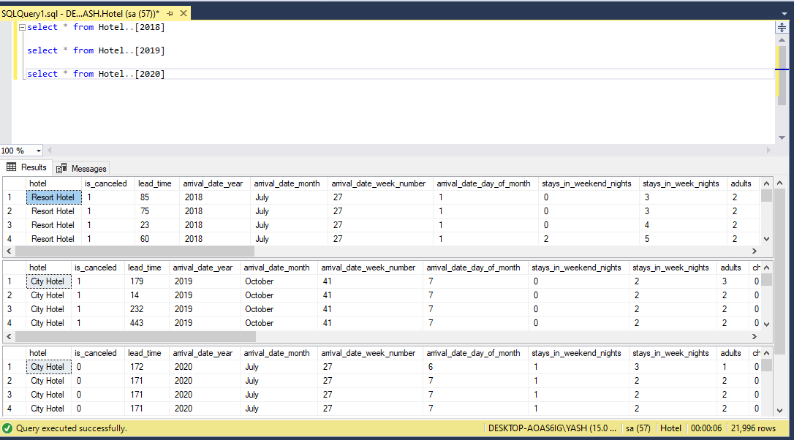
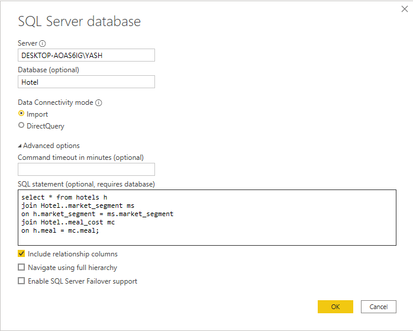
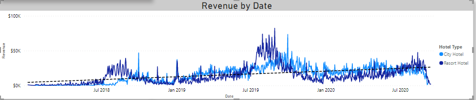
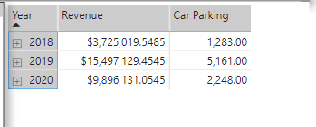

# Hotel Trends

## Author - Yash Lokhande
## Date - 04/08/2021

This analysis was made on Hotel data, which was downloaded from [here](https://www.absentdata.com/hotel_revenue_historical_full/).

The goal of the project was to analyze and visualise the hotel booking data and answer questions like-
* Is our hotel revenue growing by year?
* Should we increase our parking size?
* What trends can we see in the data?

The analysis was made for the years 2018, 2019, 2020, based on the available data. The tools used for the project are `SQL Server`,`Power BI`.
<br />
<br />
The data contained different sheets for different years with same columns and data types, so the first thing was to combine all sheets and do an exploratory data analysis in `SQL`.

<br />
```sql
-- Combing all the 3 tables into 1, as all of them have same columns with same data type (Creating temp table)
select * into hotels
from (
select * from Hotel..[2018]
union all
select * from Hotel..[2019]
union
select * from Hotel..[2020]
) as tmp
```

EDA
```sql
-- Getting Revenue column
select hotel, arrival_date_year, (stays_in_week_nights + stays_in_weekend_nights) * adr as revenue
from hotels


-- EDA
select arrival_date_year, round(sum((stays_in_week_nights + stays_in_weekend_nights) * adr),4) as revenue
from hotels
group by arrival_date_year
order by arrival_date_year desc;
-- The revenue for the hotel is low than the previous year.
-- adr = Average daily rates


-- Breaking it down by hotel type
select hotel, arrival_date_year, round(sum((stays_in_week_nights + stays_in_weekend_nights) * adr),4) as revenue
from hotels
group by hotel, arrival_date_year
order by arrival_date_year desc;
-- The revenue for the hotel is low than the previous year.


-- The data for 2020 is only limited to 8 months and 6 months for 2018
select count(distinct arrival_date_month) from Hotel..[2020] -- 8 months
select count(distinct arrival_date_month) from Hotel..[2019] -- 12 months
select count(distinct arrival_date_month) from Hotel..[2018] -- 6 months


-- Joining other 2 tables to the new table
select * from hotels h
join Hotel..market_segment ms
on h.market_segment = ms.market_segment
join Hotel..meal_cost mc
on h.meal = mc.meal;
```

Then the data was imported to `Power BI`.
<br />

<br />
The Power BI dashboard has been attached to this folder.

<br />
With the visualization, we can answer our questions.<br />
- The revenue of the hotel is in positive trend.



- As there isn't any large difference in car parkings, it is not suggestive to increse parking size at the moment.


